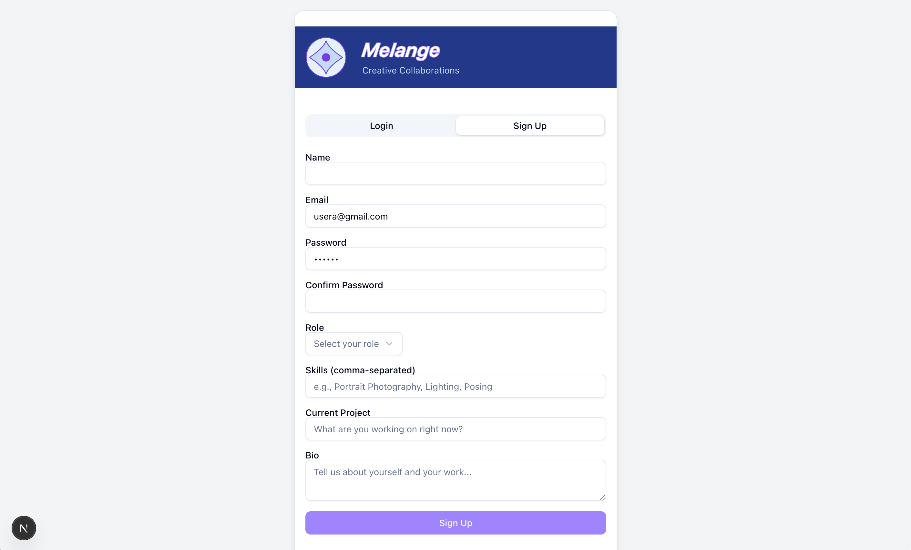
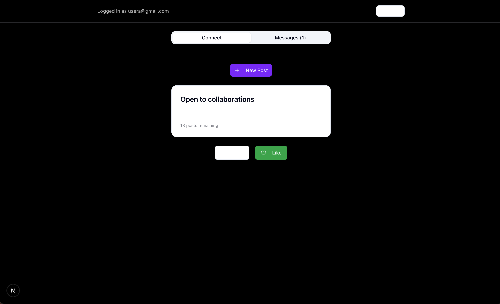
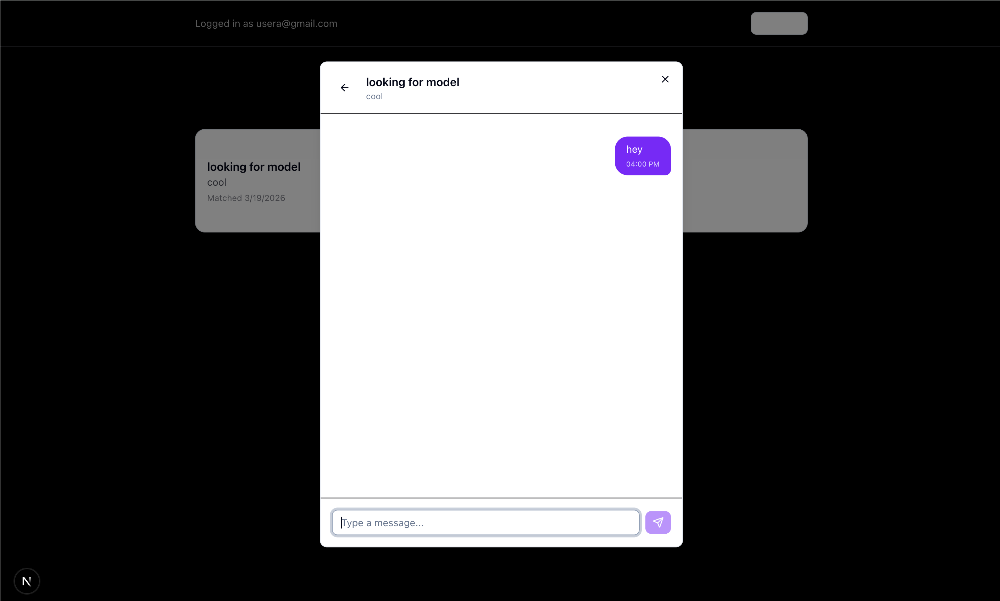

# Melange

**Tinder for creative collaborations.** Post what you're working on, swipe on others' projects, match when the interest is mutual, and message to coordinate.

## Screenshots

| Sign Up | Feed | Chat |
|---|---|---|
|  |  |  |
| User signup and profile creation | Swipe-based collaboration interface | Real-time messaging between matched users |

## How It Works

1. **Sign up** with your name, role (photographer, model, stylist, etc.), skills, and bio.
2. **Create a post** describing the collaboration you're looking for.
3. **Swipe** through other creatives' posts -- Like or Pass.
4. **Match** when both of you like each other's posts.
5. **Message** your match directly in the app to plan the collaboration.

## Features

- **Auth** -- Email/password signup and login with profile creation (name, role, skills, bio).
- **Post creation** -- Publish collaboration proposals visible to all other users.
- **Swipe feed** -- Card stack of posts from other users, excluding your own and already-swiped posts.
- **Mutual matching** -- Right-swipe on a post; if the post owner has also right-swiped on one of yours, a match is created.
- **In-app messaging** -- Chat with your matches in a per-match conversation thread.
- **Row Level Security** -- All data access enforced at the database level. Users can only read/write their own data.

## Tech Stack

| Layer | Technology |
|---|---|
| Framework | Next.js 16 (App Router, Turbopack) |
| Language | TypeScript |
| UI | React 19, Radix UI, Tailwind CSS 4 |
| Auth & Database | Supabase (Postgres, GoTrue, PostgREST) |
| Client | `@supabase/supabase-js` v2 |

No separate backend. The browser talks directly to Supabase's API, secured by Postgres RLS policies.

## Run Locally

Prerequisites: Node.js 18+, a [Supabase](https://supabase.com) project.

```bash
git clone <repo-url> && cd melange
npm install
```

Create `.env.local` in the project root:

```
NEXT_PUBLIC_SUPABASE_URL=https://<your-project-ref>.supabase.co
NEXT_PUBLIC_SUPABASE_ANON_KEY=eyJ...
```

Get both values from your Supabase Dashboard under **Settings > API**. The anon key must be the JWT format (starts with `eyJ`).

Apply the database schema by pasting the contents of `supabase_schema.sql` into your Supabase SQL Editor and running it.

Then start the dev server:

```bash
npm run dev
```

Open [http://localhost:3000](http://localhost:3000).

## Known Limitations

- **No real-time updates** -- Messages and matches load on open/refresh, not via live subscriptions.
- **No file uploads** -- Profile pictures, work samples, and media on posts are not yet supported.
- **No profile editing** -- Profile data is set at signup and cannot be changed afterward.
- **No notifications** -- New matches and messages are only visible when you navigate to the relevant tab.
- **Text-only posts** -- Posts have a title and description but no images or tags yet.
